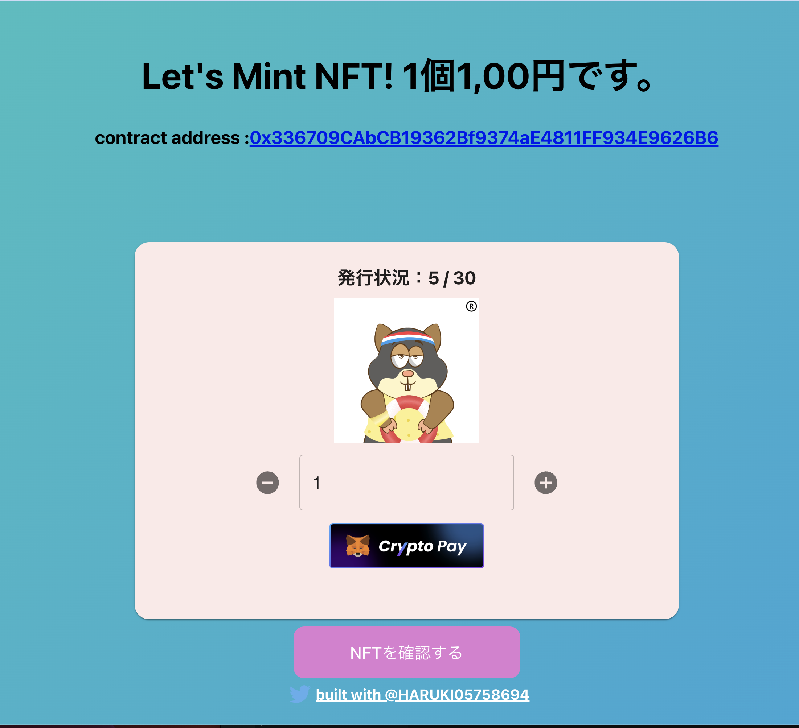

# SlashExtensionSampleApp

SlashExtensionSampleApp

## アプリの画面イメージ



## デプロイしたNFTコントラクト (Mumbai)

[0x80e1dCC9F79477a0296235e2231871CCc984152f](https://mumbai.polygonscan.com/address/0x80e1dCC9F79477a0296235e2231871CCc984152f)

## 実際にNFTを移転させたトランザクション (Mumbai)

[0x3c04d339974a7ea75600cec78dfd7b237845630a02d2ff87a1dff19f13fa180f](https://mumbai.polygonscan.com/tx/0x3c04d339974a7ea75600cec78dfd7b237845630a02d2ff87a1dff19f13fa180f)

## 決済用URLを生成するためのコマンド

```bash
curl -Ss -XPOST localhost:3001/api/generateUrl -d '{ \"amount\": \" 2000\",  \"amount_type\": \"JPY\", \"ext_reserved\": \"0x\", \"ext_description\": \"テストです。\" }'
```

### 参考サイト

1. [SushiSwap](https://app.sushi.com/swap?inputCurrency=ETH&outputCurrency=0x3813e82e6f7098b9583FC0F33a962D02018B6803&chainId=80001)
2. [GinFramework](https://gin-gonic.com/ja/docs/quickstart/)
3. [Goプロジェクトのはじめかたとおすすめライブラリ8.5選。ひな形にも使えるサンプルもあるよ。](https://qiita.com/yagi_eng/items/65cd812107362d36ae86)
4. [Slash Payment Request API](https://slash-fi.gitbook.io/docs/integration-guide/apis/payment-request-api)